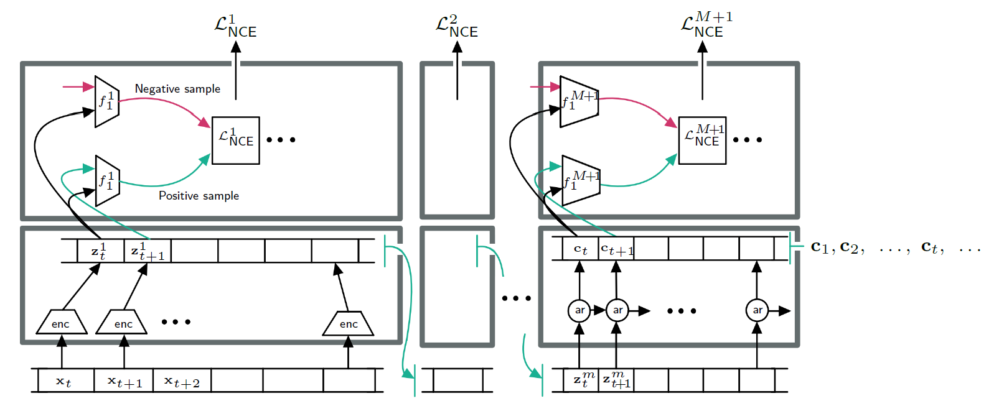
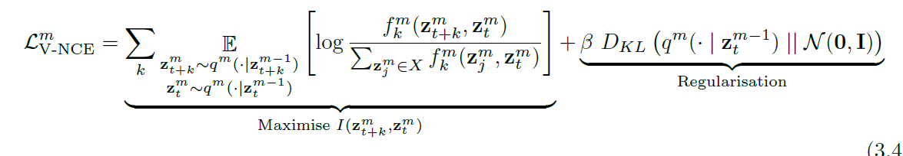

## Installation

```bash
git clone https://github.com/oBoii/Smooth-InfoMax
./download_audio_data.sh
./audio_traineval.sh
```

```bash
cd /project_ghent/Smooth-InfoMax/ && git fetch && git pull && chmod +x ./audio_traineval.sh && ./audio_traineval.sh
```

```undefined
watch -n 0.5 nvidia-smi
```

## Running the project

De boer encoder + classifier:

```shell
bash -c "set -e;
outp_dir='yyyyy_audio_distribs_distr=false_kld=0';
config_file='sim_audio_distr_false';
override='encoder_config.kld_weight=0 encoder_config.dataset.dataset=5 encoder_config.dataset.batch_size=128';


cd /project_antwerp/Smooth-InfoMax/;
git fetch; git pull;
pip install soundfile;
pip install librosa;
pip install tikzplotlib;

echo 'Training the Greedy InfoMax Model on audio data (librispeech)'; 
python -m main $outp_dir $config_file --overrides $override encoder_config.dataset.limit_train_batches=0.01 encoder_config.dataset.limit_validation_batches=0.01;

echo 'Testing syllable classification'; 
python -m linear_classifiers.logistic_regression_syllables $outp_dir $config_file --overrides $override;"
```

GIM:
```shell
outp_dir='yyyyy_audio_distribs_distr=false_kld=0';
config_file='sim_audio_distr_false';
override='encoder_config.kld_weight=0 encoder_config.dataset.dataset=5 encoder_config.dataset.batch_size=128';
```

SIM: (kld=0.0033)
```shell
outp_dir='yyyyy_audio_distribs_distr=true_kld=0.0033';
config_file='sim_audio_distr_true';
override='encoder_config.kld_weight=0.0033 encoder_config.dataset.dataset=5 encoder_config.dataset.batch_size=128';
```

CPC
```shell
outp_dir='cpc';
config_file='sim_audio_cpc';
override='encoder_config.dataset.dataset=5 encoder_config.dataset.batch_size=128';
```

```shell
python -m decoder.train_decoder ${output_dir} ${config_file} yyyyy_audio_distribs_distr=true_kld=0.0033 sim_audio_distr_true --overrides encoder_config.kld_weight=0.0033 encoder_config.dataset.dataset=5 encoder_config.dataset.batch_size=128 decoder_config.decoder_loss=2
```

Syllable classification:
```shell
python -m linear_classifiers.logistic_regression_syllables  final_yyyyy/yyyyy_full_audio_distribs_distr=true_kld=0 sim_audio_distr_false
```
